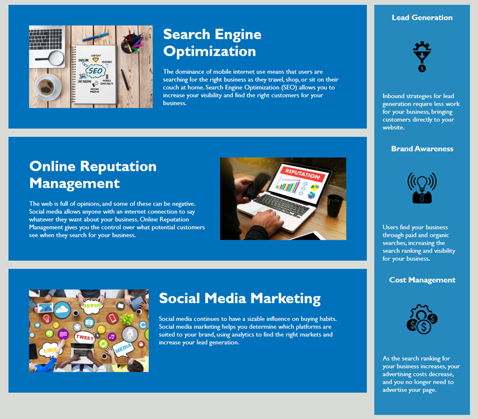

# Horiseon Refactor

## Description

Horiseon is a marketing agency that focuses on helping businesses with their search engine optimization. I was motivated to take on this project to help bring accessibility to more businesses and therefore more users.

Horiseon wanted to have their own codebase optimized to follow accessibility standards for search engines to follow their mission. I was hired to refactor their code and bring it up to accessibility standards.

This codebase uses HTML and CSS. I made sure to add semantic tags in the HTML to allow for screenreaders to be able to read the pages most important aspects first. I also added alt tags to all images for screenreaders to be able to describe the various images that would allow for users to better understand the content that Horiseon wanted to help convery their mission statement of greater accesibility.

One of the problems I ran into as a developer hired was consolidating the CSS to remove all unnecessary lines of duplicate code. After careful review the extra lines of CSS were removed and all blocks are now DRY.

```md

```
